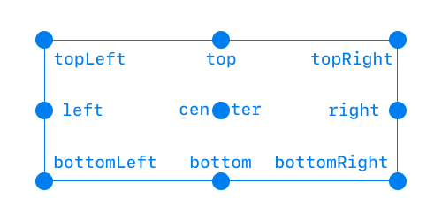
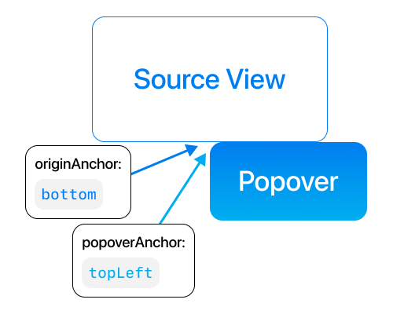
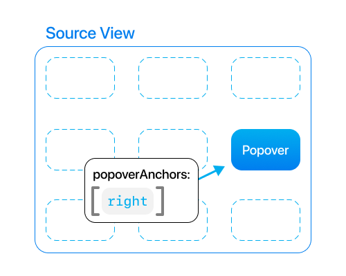
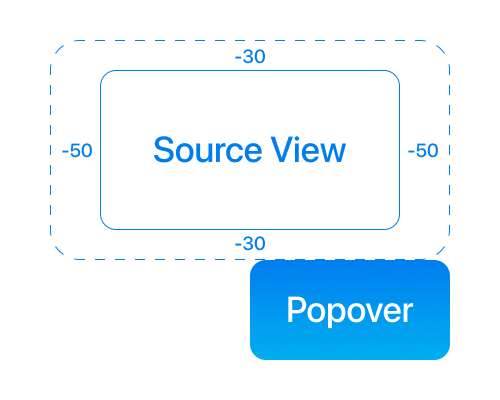
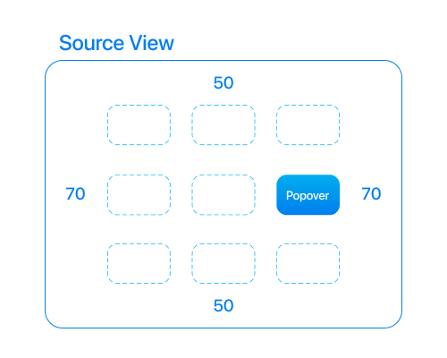

# Popovers

A library to present popovers.
- Present **any** view above your app's main content.
- Attach to source views or use picture-in-picture positioning.
- Supports multiple popovers at the same time with smooth transitions.
- Popovers are interactive and can be dragged to different positions.
- Highly customizable API that's super simple — just add `.popover`.
- Written in SwiftUI with full SwiftUI and UIKit support.

## Showroom


<table>

<tr>
<td>
Alert   
</td>
<td>
Color  
</td>
<td>
Menu   
</td>
<td>
Tip      
</td>
<td>
Standard 
</td>
</tr>

<tr>
</tr>
  
<tr>
<td>

</td>
<td>

</td>
<td>

</td>
<td>

</td>
<td>

</td>
</tr>

<tr>
</tr>
  
<tr>
<td colspan=2>
Tutorial
</td>
<td colspan=2>
Picture-in-Picture
</td>
<td>
Notification
</td>
</tr>
  
<tr>
</tr>
  
<tr>
<td colspan=2>

</td>
<td colspan=2>

</td>
<td>

</td>
</tr>

</table>

## Example
I wrote the example app with Swift Playgrounds 4, so you can run it right on your iPad. If you're using a Mac, download the Xcode version. [Download for Swift Playgrounds 4](https://github.com/aheze/Popovers/raw/main/Examples/PopoversPlaygroundApp.swiftpm.zip) • [Download for Xcode](https://github.com/aheze/Popovers/raw/main/Examples/PopoversXcodeApp.zip)


## Installation
Requires iOS 13+. Popovers can be installed through the Swift Package Manager (recommended) or [Cocoapods](https://cocoapods.org/).

<table>
<tr>
<td>
<strong>
Swift Package Manager
</strong>
<br>
Add the Package URL:
</td>
<td>
<strong>
Cocoapods
</strong>
<br>
Add this to your Podfile:
</td>
</tr>
  
<tr>
<td>
<br>

```
https://github.com/aheze/Popovers
```
</td>
<td>
<br>

```
pod 'Popovers'
```
</td>
</tr>
</table>


## Usage

To present a popover in SwiftUI, use the `.popover(present:attributes:view)` modifier. By default, the popover uses the parent view as the source frame.

```swift
import SwiftUI
import Popovers

struct ContentView: View {
    @State var present = false
    
    var body: some View {
        Button("Present popover!") {
            present = true
        }
        .popover(present: $present) { /// here!
            Text("Hi, I'm a popover.")
                .padding()
                .foregroundColor(.white)
                .background(.blue)
                .cornerRadius(16)
        }
    }
}
```

In UIKit, create a `Popover` instance, then present with `Popovers.present(_:)`. You should also set the source frame.

```swift
import SwiftUI
import Popovers

class ViewController: UIViewController {
    @IBOutlet weak var button: UIButton!
    @IBAction func buttonPressed(_ sender: Any) {
        var popover = Popover { PopoverView() }
        popover.attributes.sourceFrame = { [weak button] in
            button.windowFrame()
        }
        Popovers.present(popover) /// here!
    }
}

struct PopoverView: View {
    var body: some View {
        Text("Hi, I'm a popover.")
            .padding()
            .foregroundColor(.white)
            .background(.blue)
            .cornerRadius(16)
    }
}
```


<br>

## Customization
| [🏷](https://github.com/aheze/Popovers#tag--string)  | [💠](https://github.com/aheze/Popovers#position--position)  | [⬜](https://github.com/aheze/Popovers#source-frame-----cgrect)  | [🔲](https://github.com/aheze/Popovers#source-frame-inset--uiedgeinsets)  | [⏹](https://github.com/aheze/Popovers#screen-edge-padding--uiedgeinsets)  | [🟩](https://github.com/aheze/Popovers#presentation--presentation)  | [🟥](https://github.com/aheze/Popovers#dismissal--dismissal)  | [☄️](https://github.com/aheze/Popovers#rubber-banding-mode--rubberbandingmode)  | [🛑](https://github.com/aheze/Popovers#rubber-banding-mode--rubberbandingmode)  | [👉](https://github.com/aheze/Popovers#on-tap-outside-----void)  | [🎈](https://github.com/aheze/Popovers#on-dismiss-----void)  | [🔰](https://github.com/aheze/Popovers#on-context-change--context---void)  |
| --- | --- | --- | --- | --- | --- | --- | --- | --- | --- | --- | --- |

Customize popovers through the `Attributes` struct. Pretty much everything is customizable, including positioning, animations, and dismissal behavior.

<table>
<tr>
<td>
<strong>
SwiftUI
</strong>
<br>
Configure in the <code>attributes</code> parameter.
</td>
<td>
<strong>
UIKit
</strong>
<br>
Modify the <code>attributes</code> property.
</td>
</tr>
  
<tr>
<td>
<br>

```swift
.popover(
    present: $present,
    attributes: {
        $0.position = .absolute(
            originAnchor: .bottom,
            popoverAnchor: .topLeft
        )
    }
) {
    Text("Hi, I'm a popover.")
}
```
</td>
<td>
<br>

```swift
var popover = Popover { Text("Hi, I'm a popover.") }
popover.attributes.position = .absolute(
    originAnchor: .bottom,
    popoverAnchor: .topLeft
)
Popovers.present(popover)
```
</td>
</tr>
</table>

### 🏷 Tag • `String?`
Tag popovers to access them later from anywhere. This is useful for updating existing popovers.

```swift
/// Set the tag.
$0.tag = "Your Tag"

/// Access it later.
let popover = Popovers.popovers(tagged: "Your Tag")
```

Note: When you use the `.popover(selection:tag:attributes:view:)` modifier, this `tag` is automatically set to what you provide in the parameter.

### 💠 Position • `Position`
The popover's position can either be `.absolute` (attached to a view) or `.relative` (picture-in-picture). The enum's associated value additionally configures which sides and corners are used.

- `Anchor`s represent sides and corners.
- For `.absolute`, provide the origin anchor and popover anchor.
- For `.relative`, provide the popover anchors. If there's multiple, the user will be able to drag between them like a PIP.

Anchor Reference | `.absolute(originAnchor: .bottom, popoverAnchor: .topLeft)` | `.relative(popoverAnchors: [.right])`
--- | --- | ---
 |  | 

### ⬜ Source Frame • `(() -> CGRect)`
This is the frame that the popover attaches to or is placed within, depending on its position. This must be in global window coordinates. Because frames are can change so often, this property is a closure. Whenever the device rotates or some other bounds change happens, the closure will be called.


<table>
<tr>
<td>
<strong>
SwiftUI
</strong>
<br>
The source frame is automatically set to the parent view. You can still override it if you want.
</td>
<td>
<strong>
UIKit
</strong>
<br>
It's highly recommended to provide a source frame, otherwise the popover will appear in the top-left of the screen.
</td>
</tr>
  
<tr>
<td>
<br>

```swift
$0.sourceFrame = { /** some CGRect here */ }
```
</td>
<td>
<br>

```swift
 /// use `weak` to prevent a retain cycle
attributes.sourceFrame = { [weak button] in
    button.windowFrame()
}
```
</td>
</tr>
</table>

### 🔲 Source Frame Inset • `UIEdgeInsets`
Edge insets to apply to the source frame. Positive values inset the frame, negative values expand it.

Absolute | Relative
--- | ---
 | 

### ⏹ Screen Edge Padding • `UIEdgeInsets`
Global insets for all popovers to prevent them from overflowing off the screen. Kind of like a safe area. Default value is `UIEdgeInsets(top: 16, left: 16, bottom: 16, right: 16)`.

### 🟩 Presentation • `Presentation`
This property stores the animation and transition that's applied when the popover appears.

```swift
/// Default values:
$0.presentation.animation = .default
$0.presentation.transition = .opacity
```

### 🟥 Dismissal • `Dismissal`
This property stores the popover's dismissal behavior. There's a couple sub-properties here.

```swift
/// Same thing as `Presentation`.
$0.dismissal.animation = .default
$0.dismissal.transition = .opacity

/// Advanced stuff! Here's their default values:
$0.dismissal.mode = .tapOutside
$0.dismissal.tapOutsideIncludesOtherPopovers = false
$0.dismissal.excludedFrames = { [] }
$0.dismissal.dragMovesPopoverOffScreen = true
$0.dismissal.dragDismissalProximity = CGFloat(0.25)
```

**Mode:** Configure how the popover should auto-dismiss. You can have multiple at the same time!
- `.tapOutside` - dismiss the popover when the user taps outside it.
- `.dragDown` - dismiss the popover when the user drags it down.
- `.dragUp` - dismiss the popover when the user drags it up.
- `.none` - don't automatically dismiss the popover.

**Tap Outside Includes Other Popovers:** Only applies when `mode` is `.tapOutside`. If this is enabled, the popover will be dismissed when the user taps outside, **even when another presented popover is what's tapped**. Normally when you tap another popover that's presented, the current one will not dismiss.

**Excluded Frames:** Only applies when `mode` is `.tapOutside`. When the user taps outside the popover, but the tap lands on one of these frames, the popover will stay presented. If you want multiple popovers, you should set the source frames of your other popovers as the excluded frames.

```swift
/// Set one popover's source frame as the other's excluded frame.
/// This prevents the the current popover from being dismissed before animating to the other one.

let popover1 = Popover { Text("Hello") }
popover1.attributes.sourceFrame = { [weak button1] in button1.windowFrame() }
popover1.attributes.dismissal.excludedFrames = { [weak button2] in [ button2.windowFrame() ] }

let popover2 = Popover { Text("Hello") }
popover2.attributes.sourceFrame = { [weak button2] in button2.windowFrame() }
popover2.attributes.dismissal.excludedFrames = { [weak button1] in [ button1.windowFrame() ] }
```

**Drag Moves Popover Off Screen:** Only applies when `mode` is `.dragDown` or `.dragUp`. If this is enabled, the popover will continue moving off the screen after the user drags.

**Drag Dismissal Proximity:** Only applies when `mode` is `.dragDown` or `.dragUp`. Represents the point on the screen that the drag must reach in order to auto-dismiss. This property is multiplied by the screen's height.


### ☄️ Rubber Banding Mode • `RubberBandingMode`
Configures which axes the popover can "rubber-band" on when dragged. The default is `[.xAxis, .yAxis]`.

- `.xAxis` - enable rubber banding on the x-axis.
- `.yAxis` - enable rubber banding on the y-axis.
- `.none` - disable rubber banding.

### 🛑 Blocks Background Touches • `Bool`
Set this to true to prevent underlying views from being pressed.


### 👉 On Tap Outside • `(() -> Void)?`
A closure that's called whenever the user taps outside the popover.

### 🎈 On Dismiss • `(() -> Void)?`
A closure that's called when the popover is dismissed.

### 🔰 On Context Change • `((Context) -> Void)?`
A closure that's called whenever the context changed. The context contains the popover's attributes, current frame, and other visible traits.

<br>

## Utilities
Popovers comes with some features to make your life easier.

### ✨ Animating Between Popovers
As long as the view structure is the same, you can smoothly transition from one popover to another. 

<table>
<tr>
<td>
<strong>
SwiftUI
</strong>
<br>
Use the <code>.popover(selection:tag:attributes:view:)</code> modifier. 
</td>
<td>
<strong>
UIKit
</strong>
<br>
Get the existing popover using <code>Popovers.popover(tagged:)</code>, then call <code>Popovers.replace(_:with:)</code>.
</td>
</tr>
  
<tr>
<td>
<br>

```swift
struct ContentView: View {
    @State var selection: String?
    
    var body: some View {
        HStack {
            Button("Present First Popover") { selection = "1" }
            .popover(selection: $selection, tag: "1") {

                /// Will be presented when selection == "1".
                Text("Hi, I'm a popover.")
                    .background(.blue)
            }
            
            Button("Present Second Popover") { selection = "2" }
            .popover(selection: $selection, tag: "2") {

                /// Will be presented when selection == "2".
                Text("Hi, I'm a popover.")
                    .background(.green)
            }
        }
    }
}
```
</td>
<td>
<br>

```swift
@IBAction func button1Pressed(_ sender: Any) {
    var newPopover = Popover { Text("Hi, I'm a popover.").background(.blue) }
    newPopover.attributes.sourceFrame = { [weak button1] in button1.windowFrame() }
    newPopover.attributes.dismissal.excludedFrames = { [weak button2] in [button2.windowFrame()] }
    newPopover.attributes.tag = "Popover 1"
    
    if let oldPopover = Popovers.popover(tagged: "Popover 2") {
        Popovers.replace(oldPopover, with: newPopover)
    } else {
        Popovers.present(newPopover) /// Present if the old popover doesn't exist.
    }
}
@IBAction func button2Pressed(_ sender: Any) {
    var newPopover = Popover { Text("Hi, I'm a popover.").background(.green) }
    newPopover.attributes.sourceFrame = { [weak button2] in button2.windowFrame() }
    newPopover.attributes.dismissal.excludedFrames = { [weak button1] in [button1.windowFrame()] }
    newPopover.attributes.tag = "Popover 2"
    
    if let oldPopover = Popovers.popover(tagged: "Popover 1") {
        Popovers.replace(oldPopover, with: newPopover)
    } else {
        Popovers.present(newPopover)
    }
}
```
</td>
</tr>
</table>

|  |
| --- |

### 🌃 Background
You can put anything in a popover's background.

<table>
<tr>
<td>
<strong>
SwiftUI
</strong>
<br>
Use the <code>.popover(present:attributes:view:background:)</code> modifier. 
</td>
<td>
<strong>
UIKit
</strong>
<br>
Use the <code>Popover(attributes:view:background:)</code> initializer. 
</td>
</tr>
  
<tr>
<td>
<br>

```swift
.popover(present: $present) {
    PopoverView()
} background: { /// here!
    Color.green.opacity(0.5)
}
```
</td>
<td>
<br>

```swift
var popover = Popover {
    PopoverView()
} background: { /// here!
    Color.green.opacity(0.5)
}
```
</td>
</tr>
</table>


### 📖 Popover Reader
Reads the popover's context, which includes its frame. It's kind of like [`GeometryReader`](https://www.hackingwithswift.com/quick-start/swiftui/how-to-provide-relative-sizes-using-geometryreader), but cooler. You can put it in the popover's view or background.

```swift
.popover(present: $present) {
    PopoverView()
} background: {
    PopoverReader { context in
        Path {
            $0.move(to: context.frame.point(at: .bottom))
            $0.addLine(to: Popovers.windowBounds.point(at: .bottom))
        }
        .stroke(Color.blue, lineWidth: 4)
    }
}
```

|  |
| --- |

### 🔖 Frame Tags
Lets you tag view frames in SwiftUI. You can use this to provide a popover's `sourceFrame` or `excludedFrames`. As convenient as it is, don't use it for anything else, due to possible State issues.

```swift
Text("This is a view")
    .frameTag("Your Tag Name")

/// ...

.popover(
    present: $present,
    attributes: {
        $0.sourceFrame = Popovers.frameTagged("Your Tag Name")
    }
)
```

### 📄 Templates
Get started quickly with some templates. All of them are inside [`PopoverTemplates.swift`](Source/PopoverTemplates.swift) with example usage in the example app.
- `AlertButtonStyle` - a button style resembling a system alert.
- `VisualEffectView` - lets you use UIKit blurs in SwiftUI.
- `ContainerShadow` - a view modifier that applies a system-like shadow.
- `Container` - a wrapper view for the `BackgroundWithArrow` shape.
- `BackgroundWithArrow` - a shape with an arrow that looks like the system popover.
- `CurveConnector` - an animatable shape with endpoints that you can set.
- `Menu` - the system menu but built from scratch.
- `MenuButton` - buttons to put in the `Menu`.

<br>

## Notes
### State Re-Rendering
If you directly pass a variable down to the popover's view, it might not update. Instead, move the view into its own struct and pass down a `Binding`.

<table>
<tr>
<td>
<strong>
Yes
</strong>
<br>
The popover's view is in a separate struct, with <code>$string</code> passed down.
</td>
<td>
<strong>
No
</strong>
<br>
The button is directly inside the <code>view</code> parameter and receives <code>string</code>.
</td>
</tr>
  
<tr>
<td>
<br>

```swift
struct ContentView: View {
    @State var present = false
    @State var string = "Hello, I'm a popover."

    var body: some View {
        Button("Present popover!") { present = true }
        .popover(present: $present) {
            PopoverView(string: $string) /// Pass down a Binding ($).
        }
    }
}

/// Create a separate view to ensure that the button updates.
struct PopoverView: View {
    @Binding var string: String

    var body: some View {
        Button(string) { string = "The string changed." }
        .background(.mint)
        .cornerRadius(16)
    }
}
```
</td>
<td>
<br>

```swift
struct ContentView: View {
    @State var present = false
    @State var string = "Hello, I'm a popover."

    var body: some View {
        Button("Present popover!") {
            present = true
        }
        .popover(present: $present) {

            /// Directly passing down the variable (no $) is unsupported. The button might not update.
            Button(string) { 
                string = "The string changed."
            }
            .background(.mint)
            .cornerRadius(16)
        }
    }
}
```
</td>
</tr>
</table>

### Popover Hierarchy
To bring a popover to front, just attach [`.zIndex(_:)`](https://developer.apple.com/documentation/swiftui/view/zindex(_:)). A higher index will bring it forwards.

### Popover Not Animating At First?
Make sure that `Popovers` is set up by calling `Popovers.prepare()` when your app starts.

```swift
import SwiftUI
import Popovers

@main
struct YourApp: App {
    @Environment(\.scenePhase) private var scenePhase
    
    var body: some Scene {
        WindowGroup {
            ContentView()
        }
        .onChange(of: scenePhase) { _ in
            Popovers.prepare() /// Make sure Popovers is ready.
        }
    }
}
```


## License
Popovers is made by [aheze](https://github.com/aheze). Use it however you want.

```
MIT License

Copyright (c) 2022 A. Zheng

Permission is hereby granted, free of charge, to any person obtaining a copy
of this software and associated documentation files (the "Software"), to deal
in the Software without restriction, including without limitation the rights
to use, copy, modify, merge, publish, distribute, sublicense, and/or sell
copies of the Software, and to permit persons to whom the Software is
furnished to do so, subject to the following conditions:

The above copyright notice and this permission notice shall be included in all
copies or substantial portions of the Software.

THE SOFTWARE IS PROVIDED "AS IS", WITHOUT WARRANTY OF ANY KIND, EXPRESS OR
IMPLIED, INCLUDING BUT NOT LIMITED TO THE WARRANTIES OF MERCHANTABILITY,
FITNESS FOR A PARTICULAR PURPOSE AND NONINFRINGEMENT. IN NO EVENT SHALL THE
AUTHORS OR COPYRIGHT HOLDERS BE LIABLE FOR ANY CLAIM, DAMAGES OR OTHER
LIABILITY, WHETHER IN AN ACTION OF CONTRACT, TORT OR OTHERWISE, ARISING FROM,
OUT OF OR IN CONNECTION WITH THE SOFTWARE OR THE USE OR OTHER DEALINGS IN THE
SOFTWARE.
```

